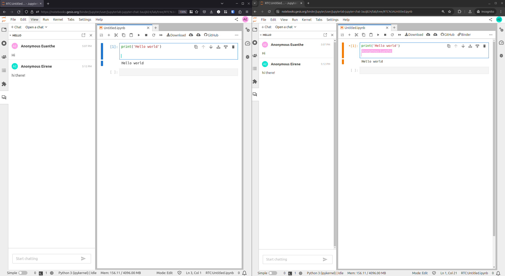

# Users

## Chat extension

The `jupyterlab-chat` extension adds chats to jupyterlab.



These chats use [jupyter_collaboration](https://jupyterlab-realtime-collaboration.readthedocs.io/en/latest/),
the collaborative edition of documents in jupyterlab.

### Install chat extension

The chat extension is available on [PyPI](https://pypi.org/project/jupyterlab-chat/).

```bash
pip install jupyterlab-chat
```

To uninstall the package:

```bash
pip uninstall jupyterlab-chat
```

### Create a chat

There are several ways to create a chat:

- using the menu : _file -> new -> chat_
- using the commands palette (`Ctrl+Shift+C`) -> _Create a new chat_
- from the left panel {w=24px},
  click on the button {h=24px}

Validating the dialog will create the new chat.

Creating a chat actually creates a file (shared document) in the tree files.

```{warning}
Currently, the left panel can only discover chat files in the root directory (to avoid
computation issues in large nested tree files), so it only creates chat files in the
root directory.

On the other hand, creating a chat using the menu or the command palette will create
the file in the current directory of the file browser.
```

### Open a chat

There are also several ways to open a chat:

- opening the file from the file browser (double click on it)
- using the commands palette (`Ctrl+Shift+C`) -> _Open a chat_. It opens a dialog to
  type the file path
- from the left panel {w=24px},
  there is a dropdown listing the chat files, in the root directory only.

```{note}
Opening the chat from the file browser or the command palette will open it in the main
area, like any other document.

Opening a chat from the left panel will open it in the left panel.
```

## Chat usage

The chat UI is composed of a list of messages and an input to send new messages.

A message can be edited or deleted by its author, using a dedicated toolbar in the
message.

### Notifications and navigation

If enabled in [settings](#chat-settings), new unread messages generate a notification.

A down arrow in the messages list allow to navigate to the last message. This button is
highlighted if some new messages are unread.

(code-toolbar)=

### Code toolbar

When code is inserted in a message, a toolbar is displayed under the code section (the
options must be set up from the [settings](#chat-settings)).

From this toolbar, the code can be copied to the clipboard:
{w=24px}.

If a notebook is opened and visible (and has an active cell), other actions are
available:

- copy the code to a new cell above the active one:
  {w=24px}
- copy the the code to a new cell below the active one:
  {w=24px}
- replace the content of the active cell with the code:
  {w=24px}

(chat-settings)=

## Chat settings

Some jupyterlab settings are available for the chats in the setting panel
(menu `Settings->Settings Editor`), with the entry _Chat_.

These settings includes:

- **sendWithShiftEnter**

  Whether to send a message using Shift-Enter instead of Enter.\
  Default: false

- **stackMessages**

  Whether to stack consecutive messages from same user.\
  Default: true

- **unreadNotifications**

  Whether to enable or not the notifications on unread messages.\
  Default: true

- **enableCodeToolbar**

  Whether to enable or not the code toolbar.\
  Default: true
